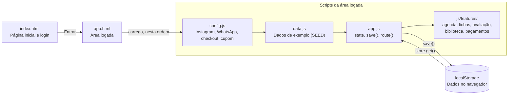

# Documentação — Site Sidnei Muller Coach (FitCore)

Atualizado em 06/10/2026

## Visão geral

O projeto é o site de consultoria online do coach **Sidnei Muller**: uma página de vendas e uma área logada (app) para alunos e para o coach. Ele é estático, publicado gratuitamente no GitHub Pages, e não depende de servidor nem de banco de dados.

| Item | Valor |
| --- | --- |
| Site publicado | [gusttavo-luiz.github.io/FitCore](https://gusttavo-luiz.github.io/FitCore/) |
| Área logada | [app.html](https://gusttavo-luiz.github.io/FitCore/app.html) |
| Repositório | [Gusttavo-Luiz/FitCore](https://github.com/Gusttavo-Luiz/FitCore) (branch `main`) |
| Público-alvo | Quem trabalha em regime CLT e quer hipertrofia treinando 1h por dia |
| Proposta (bio do Instagram) | "Resultado de ATLETA pra você CLT" |
| Instagram | [@sidneiomuller](https://www.instagram.com/sidneiomuller/) |
| Tamanho do código | 11 arquivos de código, cerca de 2.570 linhas |

O site começou como um modelo genérico chamado "FitCore Pro" e foi adaptado para a identidade do Sidnei. O nome do repositório continua FitCore.

## Tecnologias e linguagens

O site usa só as três linguagens nativas do navegador, sem framework, sem etapa de build e sem pacotes para instalar.

| Tecnologia | Uso no projeto |
| --- | --- |
| HTML5 | Estrutura das duas páginas (`index.html` e `app.html`) |
| CSS3 | Todo o visual em um arquivo, com variáveis de cor (`:root`), Grid, Flexbox e media queries |
| JavaScript (ES2020+, "vanilla") | Telas da área logada, navegação, formulários, gráficos e agenda |
| SVG | Gráficos de peso, faturamento e anel de meta, desenhados à mão no código; ícone do site e logos de Instagram e WhatsApp |
| localStorage | Onde os dados do usuário ficam salvos, no próprio navegador |
| Canvas API | Reduz as fotos das avaliações para 480 px antes de salvar |
| Google Fonts | Fonte Inter |
| GitHub Pages | Hospedagem gratuita, publicada a cada envio para a `main` |
| Git e GitHub | Controle de versões |

Não há back-end. Login, pagamentos e mensagens funcionam como demonstração, sem enviar dados para nenhum servidor.

## Estrutura de arquivos

Tudo fica na raiz do repositório; cada tela nova da área logada tem seu próprio arquivo em `js/features/`.

| Arquivo | Linhas | Função |
| --- | --- | --- |
| `index.html` | 171 | Página inicial (vendas) e janela de login |
| `app.html` | 56 | Esqueleto da área logada: menu lateral, topo, área das telas e janela modal |
| `css/style.css` | 483 | Todo o visual das duas páginas |
| `js/config.js` | 33 | Dados do coach: Instagram, WhatsApp, checkout e cupom |
| `js/data.js` | 196 | Dados de exemplo: treinos, dieta, alunos, exercícios, avaliações, cobranças e sessões |
| `js/app.js` | 739 | Núcleo: estado, salvamento, navegação, gráficos e as telas básicas |
| `js/features/biblioteca.js` | 116 | Biblioteca de exercícios com vídeos |
| `js/features/fichas.js` | 146 | Fichas de treino por aluno (coach) |
| `js/features/avaliacao.js` | 184 | Avaliação física com fotos |
| `js/features/pagamentos.js` | 174 | Pagamentos (aluno) e financeiro (coach) |
| `js/features/agenda.js` | 274 | Agenda interativa |
| `assets/logo.svg` | — | Ícone do site (monograma SM) |
| `assets/sidnei.jpg` | — | Foto do coach na seção Sobre |
| `.nojekyll` | — | Faz o GitHub Pages publicar os arquivos sem processá-los |
| `README.md` | — | Resumo do projeto |
| `docs/DOCUMENTACAO.md` | — | Este documento |

Os scripts da área logada carregam nesta ordem: `config.js` → `data.js` → `app.js` → `features/*.js`. A ordem importa, porque cada arquivo usa o que o anterior definiu.

## Configuração do site (js/config.js)

Links e dados de contato do coach ficam todos no objeto `SITE`, em `js/config.js`. Trocar um valor ali atualiza todos os botões do site de uma vez.

| Campo | Valor atual | O que controla |
| --- | --- | --- |
| `coach` | Sidnei Muller | Nome do coach na área logada |
| `instagram` | instagram.com/sidneiomuller | Botão "Falar no Instagram" e link no perfil do aluno |
| `instagramHandle` | @sidneiomuller | Texto do link no perfil do aluno |
| `threads` | threads.net/@sidneiomuller | Link do rodapé |
| `checkout` | vazio | Botões "Quero entrar pro time". Vazio = levam ao Instagram |
| `whatsapp` | 5511921410448 (exemplo) | Botão "Tirar dúvidas no WhatsApp" e botão flutuante. Vazio = botões somem |
| `whatsappMessage` | "Olá, Sidnei! Vim pelo site…" | Mensagem já escrita ao abrir o WhatsApp |
| `coupon` | CHAMP | Cupom mostrado na página |
| `couponDiscount` | 15% | Desconto mostrado ao lado do cupom |

Como funciona: os links no HTML têm o atributo `data-link="instagram"`, `"whatsapp"`, `"threads"` ou `"checkout"`. Quando a página carrega, `config.js` preenche o endereço de cada um. O WhatsApp vira um link `https://wa.me/<número>?text=<mensagem>`.

Para trocar o WhatsApp, edite a linha `whatsapp:` com DDI + DDD + número, só dígitos (ex.: `5511999999999`).

## Página inicial (index.html)

A página inicial vende a consultoria e leva o visitante ao checkout, ao WhatsApp ou à área do aluno. Ela tem quatro seções, nesta ordem:

1. **Topo (hero):** título "Resultado de *atleta* pra você que é CLT", subtítulo sobre treinar 1h por dia, botões "Quero entrar pro time" (checkout) e "Área do aluno" (login), três destaques (1h, 100% online, 15% OFF com o cupom CHAMP) e um cartão de exemplo de treino.
2. **O método:** seis cartões (1h por dia, ficha personalizada, dieta, evolução, feedback direto, tudo no app).
3. **Sobre o coach:** foto do Sidnei (`assets/sidnei.jpg`) e um texto curto de apresentação.
4. **Consultoria ("Entre pro time"):** o que está incluído e uma caixa com o cupom CHAMP e três botões: "Quero entrar pro time", "Tirar dúvidas no WhatsApp" e "Falar no Instagram".

Além das seções:

- **Menu do topo:** logo, links para Método, Sobre e Consultoria, e o botão Entrar.
- **Botão flutuante do WhatsApp:** fica no canto inferior direito durante a rolagem.
- **Rodapé:** links para Threads e Consultoria.
- **Janela de login:** escolhe Aluno ou Coach, salva o nome no navegador e abre `app.html`. Não há verificação de senha.

## Área logada (app.html)

A área logada tem 10 telas para o aluno e 8 para o coach. Cada tela tem um endereço próprio no formato `app.html#/<perfil>/<tela>`; o item "Ver como coach / aluno" do menu troca de perfil.

**Telas do aluno** (`#/cliente/...`)

| Tela | Endereço | O que faz |
| --- | --- | --- |
| Dashboard | `dashboard` | Peso, gordura, treinos da semana, água, treino do dia, meta, gráfico de peso, próximas sessões |
| Treinos | `treinos/<ficha>` | Fichas A, B, C…; marcar exercícios, finalizar treino, cronômetro de descanso |
| Exercícios | `biblioteca/<exercício>` | 35 exercícios com busca, filtro por grupo, dicas e vídeo |
| Dieta | `dieta` | 6 refeições marcáveis e resumo de calorias e macros |
| Evolução | `evolucao` | Gráficos de peso e gordura, nova medição, histórico com IMC |
| Avaliação física | `avaliacao` | 7 medidas + fotos de frente, lado e costas; comparação antes e depois |
| Agenda | `agenda/<data>/<sessão>` | Calendário, solicitar horário, remarcar, cancelar, adicionar ao Google Agenda |
| Pagamentos | `pagamentos` | Plano, cobranças em aberto, pagamento simulado (Pix), histórico |
| Mensagens | `mensagens` | Chat com o coach (respostas automáticas de demonstração) |
| Perfil | `perfil` | Altura, idade, telefone, assinatura, link do Instagram |

**Telas do coach** (`#/personal/...`)

| Tela | Endereço | O que faz |
| --- | --- | --- |
| Dashboard | `dashboard` | Alunos ativos, faturamento de 6 meses, aderência média, alunos em atenção |
| Alunos | `alunos` | Lista com busca e filtro; cadastro de aluno |
| Fichas de treino | `fichas/<ficha>` | Criar, editar, reordenar, duplicar, excluir e copiar fichas de cada aluno |
| Exercícios | `biblioteca/<exercício>` | Igual ao aluno, mais o campo para colar o link do vídeo (YouTube, Vimeo ou .mp4) |
| Avaliações | `avaliacoes` | Avaliações de qualquer aluno |
| Financeiro | `financeiro` | Recebido no mês, a receber, em atraso; marcar pago; gerar cobrança |
| Agenda | `agenda/<data>/<sessão>` | Confirmar ou recusar solicitações, agendar, editar, filtrar por aluno |
| Mensagens | `mensagens` | Chat com o aluno |

Na demonstração, a área do aluno mostra sempre os dados de "Lucas Andrade" e a do coach, sempre os do Sidnei.

## Principais funções e organização do código

Toda tela é um objeto com quatro partes: `title()`, `sub()`, `render()`, que devolve o HTML, e `bind()`, que liga os cliques. As telas do aluno ficam em `clientPages` e as do coach em `trainerPages`. A função `route()` lê o endereço, escolhe a tela e a desenha.

A cada ação do usuário, o fluxo é sempre o mesmo:

1. O clique altera o objeto `state`, por exemplo marcando um exercício como feito.
2. `save()` grava o `state` no `localStorage`.
3. `route()` desenha a tela de novo com os dados atualizados.

Os scripts carregam da esquerda para a direita; `app.js` concentra o estado e é o único que lê e grava o `localStorage`.

**Núcleo (`js/app.js`)**

| Função | O que faz |
| --- | --- |
| `store.get` / `store.set` | Lê e grava no `localStorage` com o prefixo `fitcore_`; `set` avisa quando o armazenamento enche |
| `save()` | Grava todo o `state`; mostra aviso se as fotos encherem o armazenamento |
| `route()` | Lê `#/<perfil>/<tela>/<parâmetro>/<extra>`, monta o menu, desenha a tela e chama o `bind` |
| `navBadge()` | Números no menu (mensagens; solicitações de agenda pendentes para o coach) |
| `modal()` / `closeModal()` | Abre e fecha a janela sobreposta usada por formulários e detalhes |
| `toast()` | Mensagem curta no rodapé da tela ("Treino finalizado!") |
| `ring()`, `lineChart()`, `barChart()` | Desenham em SVG o anel da meta, as linhas de peso e gordura e as barras de faturamento |
| `planOf()`, `myPlan()`, `todayWorkout()` | Fichas de um aluno e o treino do dia, pelo dia da semana da ficha |
| `visibleSessions()`, `upcomingSessions()`, `sessionItem()` | Sessões da agenda visíveis para quem está logado e o item clicável de cada uma |
| `esc()` | Protege textos digitados antes de colocá-los no HTML |
| `fmtDate()`, `num()`, `money()` | Formatam data, número e valor em reais no padrão brasileiro |

**Telas extras (`js/features/`)**

| Função | Arquivo | O que faz |
| --- | --- | --- |
| `videoEmbed()` | biblioteca.js | Converte um link do YouTube, Vimeo ou .mp4 em vídeo embutido |
| `libraryOptions()`, `newId()` | fichas.js | Lista de exercícios para adicionar à ficha; gera ids únicos |
| `compressImage()` | avaliacao.js | Reduz a foto para no máximo 480 px em JPEG antes de salvar |
| `renderAssessments()`, `openAssessmentForm()` | avaliacao.js | Comparação antes e depois; formulário de nova avaliação |
| `invoiceStatus()` | pagamentos.js | Classifica a cobrança como Pago, Em aberto ou Atrasado |
| `openPayment()`, `financeTable()` | pagamentos.js | Janela de pagamento do aluno; tabela de cobranças do coach |
| `conflictWith()`, `freeSlots()` | agenda.js | Detectam choque de horário e listam horários livres entre 6h e 21h |
| `googleCalendarUrl()` | agenda.js | Monta o link "Adicionar ao Google Agenda" |
| `openSessionForm()`, `openSessionDetail()` | agenda.js | Agendar, remarcar e ver os detalhes de uma sessão |

**Configuração (`js/config.js`):** o objeto `SITE` e o preenchimento automático dos links com `data-link`.

## Dados e armazenamento

Os dados ficam no `localStorage` do navegador de quem usa: cada pessoa e cada aparelho têm a sua cópia, e nada é compartilhado entre aluno e coach. Na primeira visita, o site parte dos exemplos de `js/data.js`.

| Chave (`fitcore_` + …) | Conteúdo |
| --- | --- |
| `user` | Nome, e-mail e perfil (aluno ou coach) do login |
| `plans` | Fichas de treino de cada aluno |
| `done`, `workoutDays` | Exercícios marcados no dia e dias com treino finalizado |
| `meals_<data>`, `water_<data>` | Refeições feitas e água bebida em cada dia |
| `progress` | Medições de peso, gordura e cintura (gráficos de evolução) |
| `assessments` | Avaliações físicas, com as fotos em texto (base64) |
| `videos` | Link do vídeo de cada exercício da biblioteca |
| `invoices` | Cobranças: aluno, plano, valor, vencimento, data e forma de pagamento |
| `sessions` | Sessões da agenda: aluno, data, horário, duração, tipo, local, status |
| `students` | Lista de alunos do coach |
| `messages` | Conversa do chat |
| `profile` | Altura, idade e telefone do aluno |

**Status das sessões:** `confirmada`, `pendente` (pedido do aluno aguardando o coach) e `cancelada`.

**Limite:** o navegador costuma dar cerca de 5 MB por site. Cada foto reduzida ocupa dezenas de KB, então cabem algumas dezenas. Quando enche, o site avisa e desfaz a última avaliação.

Para começar do zero, apague os dados do site nas configurações do navegador.

## Visual

O visual segue o Instagram do Sidnei: preto profundo, branco e prata. Todas as cores ficam como variáveis no início de `css/style.css`, então trocar a paleta é editar um só lugar.

| Variável | Cor | Uso |
| --- | --- | --- |
| `--bg` | `#050505` | Fundo da página |
| `--surface` / `--surface-2` | `#0d0d0e` / `#161618` | Cartões e campos |
| `--border` | `#232325` | Bordas |
| `--text` / `--muted` | `#f5f5f5` / `#8e8e95` | Texto principal e secundário |
| `--accent` | `#ffffff` | Botões principais, gráficos, destaques |
| `--accent-2` | `#9a9aa2` | Prata (degradê do logo, "MULLER") |
| `--green` / `--red` / `--orange` / `--blue` | `#3fd58a` / `#ff5c6c` / `#f0b44c` / `#7fb2ff` | Status: pago, atrasado, aguardando, online |
| WhatsApp | `#25d366` | Cor oficial do botão do WhatsApp |
| Instagram | degradê laranja → rosa → roxo | Cor oficial do botão do Instagram |

- **Fonte:** Inter (Google Fonts), pesos 400 a 900.
- **Logo:** monograma "SM" em quadrado prata inclinado + "SIDNEI MULLER" em itálico maiúsculo + etiqueta COACH. É provisório, até chegar o logo oficial.
- **Título da página inicial:** a palavra *atleta* aparece só com o contorno das letras.
- **Responsivo:** em telas abaixo de 900 px, as colunas viram uma só e o menu lateral da área logada vira um menu que abre pelo botão ☰. Abaixo de 520 px, os cartões de números empilham. Testado em 1400 px, 1024 px e 390 px (celular), sem rolagem lateral.

## Publicação e manutenção

O site vai ao ar sozinho: cada envio para a branch `main` dispara o GitHub Pages, que publica em 1 a 2 minutos.

**Configuração do GitHub Pages** (Settings → Pages do repositório FitCore): Source = *Deploy from a branch*, Branch = `main`, pasta = `/ (root)`. A pasta `/docs` não funciona, porque o site está na raiz.

**Para alterar o site:**

1. Edite os arquivos: textos em `index.html`, cores em `css/style.css`, links em `js/config.js`.
2. Teste localmente: rode `python3 -m http.server` na pasta e abra `http://localhost:8000`.
3. Atualize o número de versão `?v=...` nos links de CSS e JS de `index.html` e `app.html`.
4. Envie para a `main` e confira a publicação na aba **Actions** ("pages build and deployment").

**Por que o número de versão:** o navegador guarda os arquivos de estilo e de código. Sem trocar o `?v=`, um visitante pode ver o HTML novo com o CSS antigo, como aconteceu quando o logo saiu do lugar. Se algo parecer antigo, recarregue com Ctrl+Shift+R.

**Desenvolvimento:** as mudanças foram feitas na branch `claude/personal-trainer-website-9nf2zo` e depois enviadas para a `main`.

## Histórico de mudanças

Todas as mudanças foram feitas em 06/10/2026, na ordem abaixo (mais recente primeiro). O código do commit permite ver a mudança exata no GitHub.

| # | Commit | Mudança |
| --- | --- | --- |
| 16 | — | Esta documentação adicionada ao repositório (`docs/DOCUMENTACAO.md`) |
| 15 | `e09fa1b` | Removida a faixa "Feedbacks e evolução do time" e o link Feedbacks do menu |
| 14 | `bcde158` | Mantidos só os botões de WhatsApp e Instagram da caixa do cupom e o botão flutuante; saíram os do rodapé, da faixa de feedbacks e do menu lateral |
| 13 | `24afe90` | Removidos os botões de Instagram e WhatsApp do topo e da seção Sobre |
| 12 | `23bff46` | Botões de WhatsApp (número de exemplo) e Instagram com cores e logos oficiais; botão flutuante do WhatsApp |
| 11 | `fb8d429` | Foto do Sidnei na seção Sobre |
| 10 | `431604a` | Agenda interativa: calendário clicável, solicitar/confirmar/remarcar/cancelar, horários livres, conflito de horário, Google Agenda |
| 9 | `d8668ca` | Número de versão nos arquivos para evitar cache antigo; logo do menu lateral contido |
| 8 | `7479bca` | Site adaptado ao Sidnei: paleta preto/branco/prata, textos da bio, seções Sobre e Consultoria, cupom CHAMP, link do Instagram, sem números e depoimentos inventados |
| 7 | `7a233ff` | Logo com raio e nome em itálico; ícone do site (depois substituído pelo monograma SM) |
| 6 | `d091d39` | Paleta escura com laranja (depois substituída pelo preto e branco) |
| 5 | `ad6164c` | Biblioteca de exercícios com vídeos, avaliação física com fotos, pagamentos e financeiro, várias fichas por aluno |
| 4 | `e63e302` | Site criado no repositório próprio FitCore e publicado no GitHub Pages |
| 3 | QR-Code-Wi-fi #3 | Removida a cópia do site do repositório do gerador de QR Code |
| 2 | QR-Code-Wi-fi #2 | Redirecionamento da raiz para o site |
| 1 | QR-Code-Wi-fi #1 | Primeira versão "FitCore Pro": página inicial, área do aluno e do personal |

Os itens 1 a 3 aconteceram no repositório [Gusttavo-Luiz/QR-Code-Wi-fi](https://github.com/Gusttavo-Luiz/QR-Code-Wi-fi), antes do site ganhar repositório próprio. Um PR aberto lá, [#4](https://github.com/Gusttavo-Luiz/QR-Code-Wi-fi/pull/4), ficou sem merge.

## Limitações, pendências e próximos passos

A maior limitação é não ter servidor: aluno e coach não compartilham dados. Uma solicitação de horário feita no celular do aluno não chega ao coach.

**Limitações atuais**

- Login sem senha real; qualquer pessoa entra como aluno ou coach.
- Dados só no navegador de cada pessoa, com limite de cerca de 5 MB.
- Pagamentos simulados: nenhum valor é cobrado.
- Chat com respostas automáticas de demonstração.
- Vídeos dos exercícios não vêm prontos; o coach cola o link de cada um.
- Foto do Sidnei em baixa resolução (cerca de 280 × 300 px).

**Pendências de conteúdo**

- [ ] Link completo do checkout da Prime Coaching (hoje os botões levam ao Instagram)
- [ ] Número real do WhatsApp do Sidnei (hoje é um número de exemplo)
- [ ] Logo oficial do Sidnei, para substituir o monograma SM
- [ ] Foto em alta resolução (pelo menos 800 px de largura)
- [ ] CREF, se houver
- [ ] Confirmar se o cupom CHAMP dá 15% em toda a consultoria
- [ ] Revisão do texto "Sobre o coach" pelo Sidnei

**Próximos passos técnicos sugeridos**

1. Banco de dados e login reais (Supabase ou Firebase), para aluno e coach verem os mesmos dados.
2. Pagamento real pela Prime Coaching ou por outro provedor (Mercado Pago, Stripe).
3. Notificações por WhatsApp ou e-mail quando uma sessão for solicitada ou confirmada.
4. Domínio próprio (ex.: sidneimuller.com.br) apontando para o GitHub Pages.
